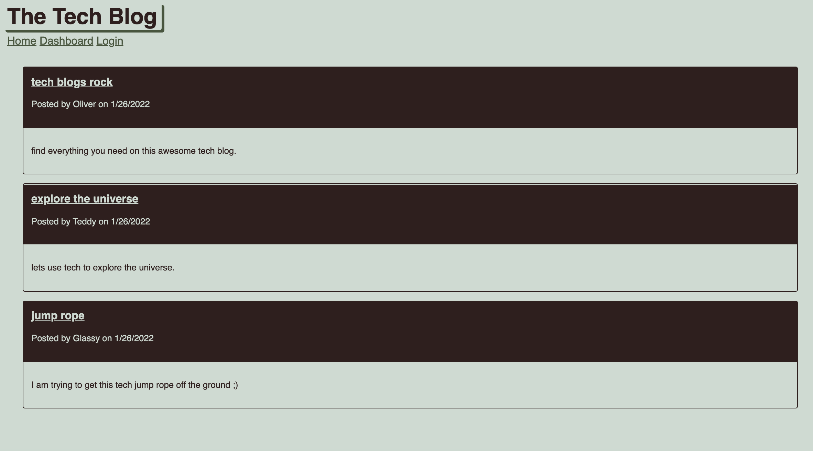

# tech-blog

## Description

A tech blog site where developers can publish their blog posts and comment on other developers’ posts as well. This app follows the MVC paradigm in its architectural structure, using Handlebars.js as the templating language, Sequelize as the ORM, and the express-session npm package for authentication.

## Installation

To install please clone this repository from GitHub on your terminal.

## Usage

Navigate to the root folder, run the following commands from the CLI:

Install packages
`npm i`

Seed DB
`npm run seed`

Start Server
`npm start server`

deployed applicaiton: https://tech-blog-uw.herokuapp.com/

## Credits

Used tutorials from:  
Week 14 Activities  
Project 2 during coding bootcamp.

## How to Contribute

Update functionality to have better UI.  
Add payment processor for being part of tech blog.  
Add notifications for when new posts or comments are made.
